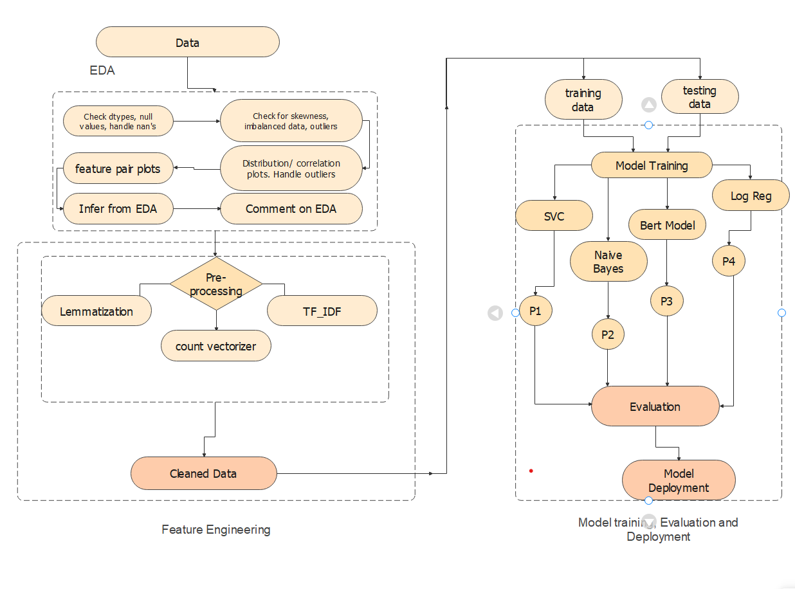

# **Team members:**
Nmeso, Mekondjo, Lali, Akhil

# **Goal**
In module 3 of the DSI, the purpose is the explore and appy Natural Language Processing (NLP). 
After each team member had come up with at least one idea, it was decided that we would explore and implement a sarcasm detector. 

# **Background**
The Cambridge English dictionary defines sarcasm as "the use of remarks that clearly mean the opposite of what they say, made in 
order to hurt someone's feelings or to criticize something in a humorous way" [1].  The Merriam-Webster dictionary defines it as 
"a sharp and often satirical or ironic utterance designed to cut or give pain" [2]. Not everybody would agree about these 
definitions, but sarcasm is usually when positive words are used to convey a negative message. Naturally, it differs from person 
to person and is highly dependent on the culture, gender and many other aspects. 

# **Motivation**
Especially for beginner learners of any language, identifying sarcasm can remains challenging. Things can be lost in translation, 
and people can feel hurt unintentionally. That is why the purpose of a sarcasm detector would help people understand when 
something is sarcastic and not take it the wrong way. This is why as a baseline, it was decided that we would focus on detecting 
sarcasm on news headlines as this is a form of widely consumed media. Furthermore, this might be especially applicable in social 
media circumstances such as on Twitter and Facebook. In the future this could be useful would discriminating between harmful 
content and witty sentences. 

# **Datasets**

# **Methodology**
